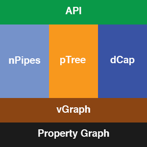

# Trepo
A Genealogical API built on vGraph, dCap, pTree, and nPipes

# REST-ish

The standard layout is `/type/id/type-specific/stuff`

The Server will only return JSON.

### Special Types

* /why (Generic Read Only Accessor)
* /person (Where most of the action happens)
* /conclusion (Generic Read Only Accessor)
* /date
* /place
* /node (Raw Access to Nodes)
* /edge (Raw Access to Edges)
* /commit (Commit related things)
* /patch (Patch that Graph)
* // TODO other system stuff

### Known Why Types

* /note

### Known Conclusion Types

* /birth
* /marriage
* /gender
* // TODO finish this based on pTree

### Unknown Types
Unknown What types are handled by asking for the raw nodes and edges, or by going through /conclusion
Unknown Why types can also be accessed via raw node and edges, or by going through /why

# Modules

### Requirements
Each module must:

* Match the conclusion or why spec
* Have test case coverage
* Match its pTree spec

### Mounting

Mount up new conclusion at:

* /new-conclusion
* /person/id/new-conclusion (Up to conclusion module to accept or reject)
* /place/id/new-conclusion (new-conclusion can throw 404 if not applicable (gender module))
* /date/id/new-conclusion

Mount up new why at:

* /new-why
* /person/id/new-why (Up to conclusion module to accept or reject)
* /conclusion-type/id/new-why (new-conclusion can throw 404 if not applicable (gender module))

Need to have a list of registered labels, and what they are (system, conclusion, or why) and route based off of that.
